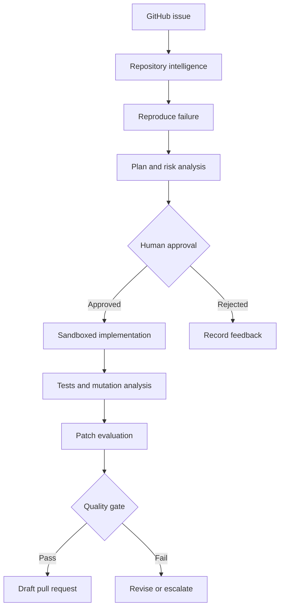
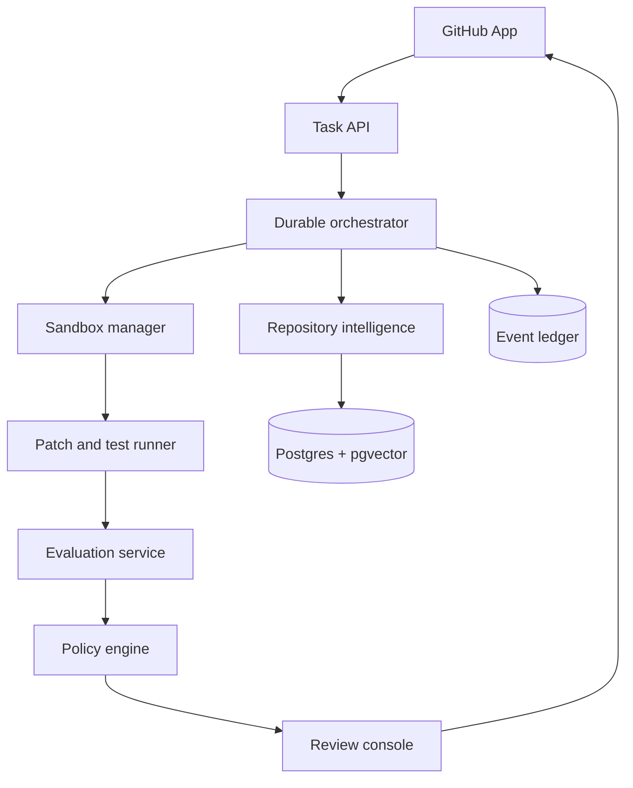

<div align="center">

# Autonomous Software Engineer Platform

**A governed, evidence-driven system for turning GitHub issues into tested draft pull requests.**

[](#implementation-status)
[](LICENSE)
[](#proposed-technology)
[](#governance-and-safety)

</div>

## Overview

The Autonomous Software Engineer Platform is an open, auditable control plane for repository-level engineering agents. Its intended workflow begins with a GitHub issue and ends with a reviewable draft pull request containing the proposed patch, generated or updated tests, execution evidence, risk notes, and a complete record of the agent's decisions.

The project is designed around one principle:

> A coding agent should earn permission to propose a change by producing reproducible evidence, not by sounding confident.

This is not intended to be an unrestricted code generator or an automatic merge bot. Consequential actions remain behind explicit policy gates and human approval.

## Problem

Coding agents can generate plausible patches, but a useful engineering system must answer harder questions:

- Did the agent understand the repository rather than retrieve a few similar files?
- Can it reproduce the reported problem before editing code?
- Is the proposed patch limited to the requested scope?
- Did the agent add meaningful tests instead of weakening existing ones?
- Does the patch pass targeted, regression, and mutation testing?
- Can a reviewer reconstruct every command, assumption, edit, and failure?
- Can the system learn from review outcomes without silently changing its authority?

This platform treats planning, execution, verification, and review as separate governed stages.

## Intended workflow



Each run will preserve a stable lineage:

```text
repositoryId
→ issueId
→ agentRunId
→ planId
→ workspaceId
→ patchId
→ evaluationId
→ pullRequestId
→ reviewDecisionId
```

## Platform modules

### 1. Repository Intelligence

Builds an incrementally updated representation of the codebase using:

- Concrete syntax trees and language-aware symbol extraction
- Imports, calls, inheritance, configuration, and test relationships
- Lexical and semantic indexes
- Git history, ownership, and change-coupling signals
- Test-to-source mappings
- Explainable context bundles for every agent decision

Retrieval will combine semantic relevance, lexical matching, graph distance, and repository history rather than relying on embeddings alone.

### 2. Issue-to-PR Orchestrator

Runs a durable, resumable state machine:

```text
INGEST_ISSUE
→ REPRODUCE_FAILURE
→ RETRIEVE_CONTEXT
→ PROPOSE_PLAN
→ AWAIT_PLAN_APPROVAL
→ CREATE_WORKSPACE
→ IMPLEMENT_PATCH
→ GENERATE_TESTS
→ VERIFY_PATCH
→ AWAIT_PR_APPROVAL
→ OPEN_DRAFT_PR
→ CAPTURE_REVIEW
```

A failed or interrupted task should resume from a recorded checkpoint. Every transition will emit a structured event.

### 3. Sandboxed Execution Plane

Executes agent-proposed commands inside disposable environments with:

- Ephemeral containers and isolated Git worktrees
- Read-only repository bases
- Explicit writable paths
- CPU, memory, process, and time limits
- Network access disabled by default
- Secret redaction
- Command and dependency policies
- Captured stdout, stderr, exit codes, and artifacts

The agent will not receive host-level Docker access or direct authority over protected branches.

### 4. Verification Engine

Evaluates more than whether the visible test suite passes:

- Formatting, linting, type checking, and static analysis
- Failure reproduction before implementation
- Targeted tests for changed behavior
- Full regression suites
- Mutation testing for test strength
- Patch-scope and API-compatibility checks
- Detection of deleted, skipped, or weakened tests
- Dependency and security-policy checks

### 5. Evaluation Harness

Measures both final patches and the trajectories that produced them.

Planned evaluation layers:

1. Deterministic tasks derived from controlled repositories
2. Repository-level benchmark adapters, including SWE-bench
3. Hidden regression tests
4. Repeated runs for stability measurement
5. Human-reviewed shadow tasks
6. Adversarial tasks targeting scope, security, and test integrity

The platform is intended to integrate with [Sentinel Eval Harness](https://github.com/MadanMohan0537/sentinel-eval-harness) rather than duplicating its evaluation ledger and release-gating foundation.

### 6. Human Feedback Ledger

Stores structured review outcomes such as:

- Plan approved, rejected, or revised
- Files accepted or rejected
- Unnecessary refactoring
- Missed edge cases
- Incorrect assumptions
- Test-quality problems
- Security and policy violations
- Reviewer correction distance

Early feedback will improve retrieval, policies, prompts, and failure analysis. The project will not claim reward-model training until a sufficiently large and reviewed dataset exists.

### 7. GitHub Integration

The GitHub integration is expected to support:

- Issue and label triggers
- Repository installation and permission boundaries
- Draft branches and draft pull requests
- Check runs and evaluation summaries
- Reviewer feedback ingestion
- Idempotent webhook processing
- Protected-branch enforcement

The first versions will create draft pull requests only. They will not merge or deploy changes autonomously.

## Proposed system architecture



## Proposed technology

| Concern | Initial choice | Reason |
|---|---|---|
| Orchestration | LangGraph with typed state | Durable, interruptible agent workflows |
| API services | Python and FastAPI | Strong ecosystem for analysis and evaluation |
| Code parsing | Tree-sitter | Incremental, language-aware syntax trees |
| Graph analysis | NetworkX initially | Transparent graph algorithms and rapid iteration |
| Persistence | PostgreSQL | Durable task, event, and review records |
| Vector search | pgvector | Semantic retrieval without a separate database |
| Queue | Redis Streams initially | Recoverable background execution |
| Isolation | Docker, with stronger runners later | Reproducible disposable workspaces |
| UI | Next.js | Plan, diff, evidence, and approval console |
| Observability | OpenTelemetry | Portable traces, metrics, and logs |
| CI | GitHub Actions | Pull-request verification and artifacts |

All infrastructure choices remain replaceable through typed interfaces. The agent runtime, model provider, vector store, and execution backend should not be hard-coded together.

## Evaluation metrics

| Dimension | Metric |
|---|---|
| Correctness | Issue resolution rate and hidden-test pass rate |
| Safety | Unsafe command interception and policy violation rate |
| Testing | Mutation score change and regression detection rate |
| Scope | Unnecessary-file change rate and patch precision |
| Reliability | Reproducibility across repeated runs |
| Reviewability | Evidence completeness and reviewer correction distance |
| Human value | Plan approval and pull-request acceptance rates |
| Efficiency | Time, tokens, and cost per accepted patch |

A passing public test suite alone will never count as sufficient evidence.

## Governance and safety

Initial non-negotiable boundaries:

- No autonomous merges
- No direct writes to protected branches
- No production deployment authority
- No network access inside sandboxes unless a policy explicitly grants it
- No secret values in prompts, logs, patches, or artifacts
- No dependency installation without policy evaluation
- No acceptance of a patch that deletes or weakens required tests
- Human approval before implementation and before pull-request creation
- Complete command and artifact provenance
- Fail-closed behavior when repository policy or execution evidence is missing

Repository-local policy will eventually be configurable through a versioned file such as `.ase/policy.yaml`.

## Planned repository structure

```text
.
├── apps/
│   ├── api/                    # Control-plane API
│   └── review-console/         # Human review interface
├── packages/
│   ├── contracts/              # Typed domain and event contracts
│   ├── repo-intelligence/      # AST, graph, and retrieval pipeline
│   ├── orchestrator/           # Durable issue-to-PR workflow
│   ├── sandbox/                # Isolated execution adapters
│   ├── verification/           # Tests, mutations, and patch checks
│   ├── evaluation/             # Benchmark and Sentinel adapters
│   ├── github-app/             # GitHub events and PR operations
│   └── policy/                 # Deterministic authority gates
├── benchmarks/                 # Internal and external task adapters
├── datasets/                   # Versioned task specifications
├── docs/
│   ├── ARCHITECTURE.md
│   ├── PRD.md
│   ├── THREAT_MODEL.md
│   └── EVALUATION.md
├── tests/
├── .github/workflows/
├── LICENSE
└── README.md
```

This structure is the target architecture and will be introduced incrementally. Empty placeholder services will not be added merely to make the repository appear complete.

## Delivery roadmap

### Phase 1: Repository intelligence

- Define repository, symbol, relationship, and context contracts
- Parse an initial set of Python and TypeScript repositories
- Build import, call, definition, and test graphs
- Implement incremental refresh
- Produce explainable context bundles

### Phase 2: Reproducible task execution

- Ingest a GitHub issue
- Create an isolated worktree
- Reproduce the reported failure
- Record commands and artifacts
- Generate a bounded implementation plan

### Phase 3: Governed patching

- Add approval checkpoints
- Apply model-generated edits through constrained tools
- Enforce file and command policies
- Preserve patch provenance

### Phase 4: Verification

- Run targeted and regression tests
- Generate candidate tests
- Add mutation and test-integrity analysis
- Introduce deterministic patch-quality gates

### Phase 5: Draft pull requests

- Implement the GitHub App
- Publish check runs and evidence summaries
- Open draft pull requests after approval
- Capture structured reviewer feedback

### Phase 6: Benchmarking and learning

- Connect Sentinel
- Add controlled repository tasks
- Add SWE-bench-compatible execution
- Publish reproducible evaluation reports
- Use review history for retrieval and policy improvement

## Implementation status

The repository is currently in the **architecture phase**.

Completed:

- Repository created
- Product boundary defined
- Architecture and module responsibilities documented
- Governance constraints established
- Evaluation strategy defined

Not yet implemented:

- Codebase indexing
- Agent orchestration
- Sandboxed execution
- Test generation
- GitHub App
- Review console
- Benchmark runs
- Model training or fine-tuning

This section will be updated only when capabilities are implemented and verified.

## Product principles

- Reproduce before editing.
- Retrieve evidence, not just similar text.
- Separate model proposals from execution authority.
- Prefer deterministic gates for consequential decisions.
- Preserve failures rather than hiding them in aggregate scores.
- Require human review at meaningful boundaries.
- Make every claim traceable to code, tests, or recorded evidence.
- Never describe a planned capability as implemented.

## Contributing

The project is at an early design stage. Architecture discussions, threat-model reviews, reproducible benchmark tasks, and tightly scoped implementation contributions are welcome.

Before submitting a change, ensure it preserves the project's human-approval and evidence-lineage principles.

## License

Licensed under the [Apache License 2.0](LICENSE).
