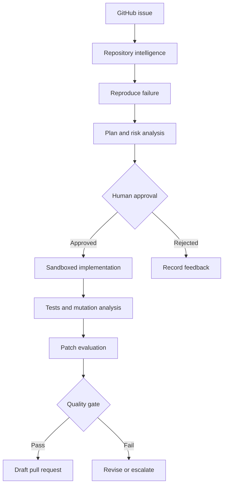
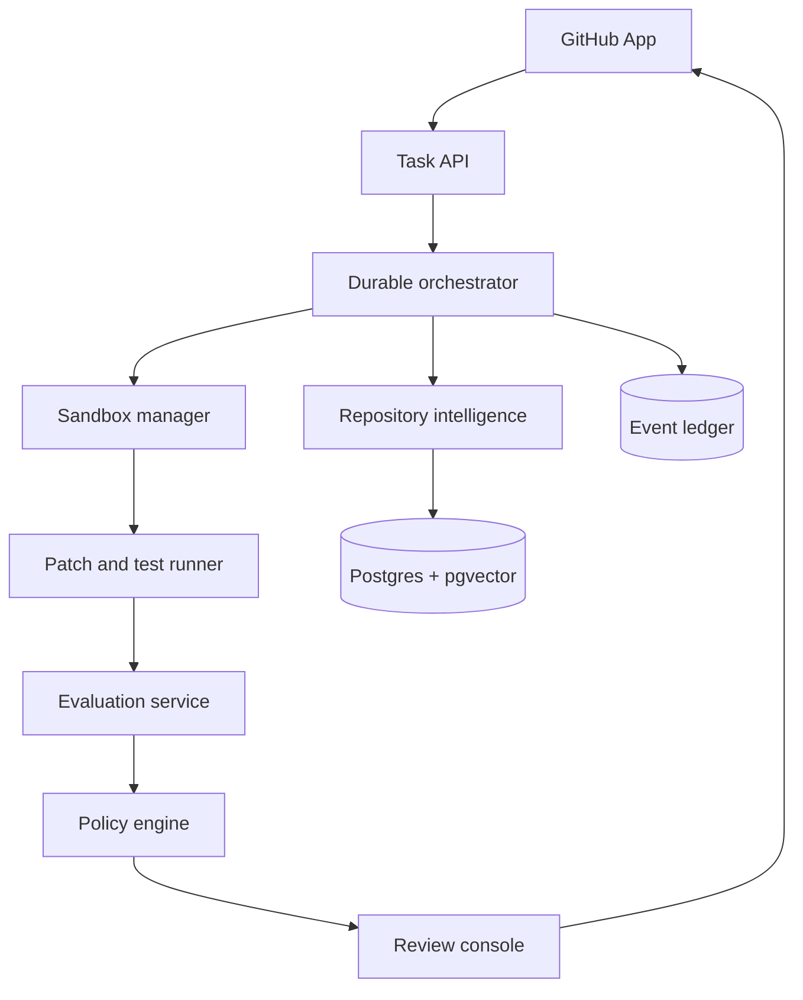

<div align="center">

# Autonomous Software Engineer Platform

**A governed, evidence-driven system for turning GitHub issues into tested draft pull requests.**

[](https://github.com/MadanMohan0537/autonomous-software-engineer-platform/actions/workflows/ci.yml)
[](#implementation-status)
[](LICENSE)
[](#proposed-technology)
[](#governance-and-safety)

</div>

## Overview

The Autonomous Software Engineer Platform is an open, auditable control plane for repository-level engineering agents. Its intended workflow begins with a GitHub issue and ends with a reviewable draft pull request containing the proposed patch, generated or updated tests, execution evidence, risk notes, and a complete record of the agent's decisions.

The project is designed around one principle:

> A coding agent should earn permission to propose a change by producing reproducible evidence, not by sounding confident.

This is not intended to be an unrestricted code generator or an automatic merge bot. Consequential actions remain behind explicit policy gates and human approval.

## Problem

Coding agents can generate plausible patches, but a useful engineering system must answer harder questions:

- Did the agent understand the repository rather than retrieve a few similar files?
- Can it reproduce the reported problem before editing code?
- Is the proposed patch limited to the requested scope?
- Did the agent add meaningful tests instead of weakening existing ones?
- Does the patch pass targeted, regression, and mutation testing?
- Can a reviewer reconstruct every command, assumption, edit, and failure?
- Can the system learn from review outcomes without silently changing its authority?

This platform treats planning, execution, verification, and review as separate governed stages.

## Run it

Requires Python 3.11 or later and git. Nothing below needs a model key or a GitHub token
until the step that says so; every command runs offline against this repository.

```bash
git clone https://github.com/MadanMohan0537/autonomous-software-engineer-platform.git
cd autonomous-software-engineer-platform
python -m venv .venv && source .venv/bin/activate
pip install -e '.[dev,index,graph,sandbox]'   # extras are optional; see pyproject.toml
make check                                     # ruff, mypy --strict, pytest with coverage
```

### 1. Repository intelligence

```bash
ase index . --output artifacts/index.json          # files, symbols, calls, imports
ase knowledge build .                              # chunks + BM25 + embeddings + code graph, keyed by HEAD
ase knowledge search . "how are pull request reviews mirrored" -k 5
ase knowledge eval . --limit 20                    # recall@k against this repo's own history
```

Set `VOYAGE_API_KEY` to swap the hashing embedder for `voyage-code-3`; the index format
and the ranking are otherwise identical.

### 2. Issue-to-PR agent

```bash
export ANTHROPIC_API_KEY=...                       # the agent needs a model
ase run . --issue 1 --title "harvest fails on a root commit" \
  --body "ase eval harvest raises CalledProcessError when the repo has a single commit"
```

Without `--graph` the run is sequential and asks for each gate decision in the terminal.
With `--graph` (the `graph` extra) the same nodes run under LangGraph with a SQLite
checkpoint: the run pauses at the plan gate, exits, and any later process can resume it:

```bash
ase run . --graph --issue 1 --title "..."          # → "paused at the plan gate; resume with: ase resume ..."
ase resume . <run_id> --approve                    # plan gate → implement → verify → reflect → pauses at PR gate
ase resume . <run_id> --approve                    # PR gate → draft pull request (needs GITHUB_TOKEN and --remote)
```

`--auto-approve` is for evaluation runs only. The API exposes the same gates
(`POST /api/runs/{id}/plan-review`, `/pr-review`) and the full trace
(`GET /api/runs/{id}/trace`):

```bash
ASE_REPOSITORY_ROOT=$PWD uvicorn ase.api:app --reload   # console at http://127.0.0.1:8000, API docs at /docs
```

### 3. Test generation and mutation testing

```bash
ase mutate . --paths src/ase/policy.py --tests tests/test_policy.py --budget 300
ase gen-tests . --paths src/ase/policy.py          # needs ANTHROPIC_API_KEY; keeps a test only if it kills a mutant
```

### 4. CI/CD agent

```bash
ase ci check <run_id>                              # needs GITHUB_TOKEN: triage the run's PR builds
printf '[{"requests":100,"errors":1,"p95_ms":120},{"requests":100,"errors":0,"p95_ms":110}]' > windows.json
ase canary simulate windows.json                   # decision engine only; deploy authority is denied by policy
```

### 5. Evaluation harness

```bash
ase eval harvest . --limit 10 --output evals/suites/local.json   # tasks from this repo's own history
ase eval run . --suite evals/suites/local.json --config structured
ase eval run . --suite evals/suites/local.json --config command_only --tool-mode command_only
ase eval report --results-dir evals/results --cases              # resolve rate, cost, tokens per config
```

### 6. Human feedback loop

```bash
ase reviews sync                                   # needs GITHUB_TOKEN: mirror PR reviews into the trace store
ase feedback dataset --output feedback/labels.jsonl
ase feedback agreement --dataset feedback/labels.jsonl                 # heuristic scorer vs human labels
ase feedback train --dataset feedback/labels.jsonl --output feedback/logistic.json
ase feedback agreement --dataset feedback/labels.jsonl --model feedback/logistic.json
```

The LoRA rung (`ase.feedback.lora`) validates a dataset and writes a training manifest;
it refuses fewer than 200 reviewed labels and does not train inside this package.

### Sandbox and policy

Every command the agent runs is an argv array checked against `.ase/policy.yaml` and run
in a sandbox. The default `local` backend is for development; build the container image
for isolation:

```bash
make sandbox-image                                 # docker/sandbox.Dockerfile → ase-sandbox:latest
ASE_EXECUTION_BACKEND=docker ase run . --issue ...
```

`.env.example` lists every setting.

## Intended workflow



Each run will preserve a stable lineage:

```text
repositoryId
→ issueId
→ agentRunId
→ planId
→ workspaceId
→ patchId
→ evaluationId
→ pullRequestId
→ reviewDecisionId
```

## Platform modules

### 1. Repository Intelligence

Builds an incrementally updated representation of the codebase using:

- Concrete syntax trees and language-aware symbol extraction
- Imports, calls, inheritance, configuration, and test relationships
- Lexical and semantic indexes
- Git history, ownership, and change-coupling signals
- Test-to-source mappings
- Explainable context bundles for every agent decision

Retrieval will combine semantic relevance, lexical matching, graph distance, and repository history rather than relying on embeddings alone.

### 2. Issue-to-PR Orchestrator

Runs a durable, resumable state machine:

```text
INGEST_ISSUE
→ REPRODUCE_FAILURE
→ RETRIEVE_CONTEXT
→ PROPOSE_PLAN
→ AWAIT_PLAN_APPROVAL
→ CREATE_WORKSPACE
→ IMPLEMENT_PATCH
→ GENERATE_TESTS
→ VERIFY_PATCH
→ AWAIT_PR_APPROVAL
→ OPEN_DRAFT_PR
→ CAPTURE_REVIEW
```

A failed or interrupted task should resume from a recorded checkpoint. Every transition will emit a structured event.

### 3. Sandboxed Execution Plane

Executes agent-proposed commands inside disposable environments with:

- Ephemeral containers and isolated Git worktrees
- Read-only repository bases
- Explicit writable paths
- CPU, memory, process, and time limits
- Network access disabled by default
- Secret redaction
- Command and dependency policies
- Captured stdout, stderr, exit codes, and artifacts

The agent will not receive host-level Docker access or direct authority over protected branches.

### 4. Verification Engine

Evaluates more than whether the visible test suite passes:

- Formatting, linting, type checking, and static analysis
- Failure reproduction before implementation
- Targeted tests for changed behavior
- Full regression suites
- Mutation testing for test strength
- Patch-scope and API-compatibility checks
- Detection of deleted, skipped, or weakened tests
- Dependency and security-policy checks

### 5. Evaluation Harness

Measures both final patches and the trajectories that produced them.

Planned evaluation layers:

1. Deterministic tasks derived from controlled repositories
2. Repository-level benchmark adapters, including SWE-bench
3. Hidden regression tests
4. Repeated runs for stability measurement
5. Human-reviewed shadow tasks
6. Adversarial tasks targeting scope, security, and test integrity

The platform is intended to integrate with [Sentinel Eval Harness](https://github.com/MadanMohan0537/sentinel-eval-harness) rather than duplicating its evaluation ledger and release-gating foundation.

### 6. Human Feedback Ledger

Stores structured review outcomes such as:

- Plan approved, rejected, or revised
- Files accepted or rejected
- Unnecessary refactoring
- Missed edge cases
- Incorrect assumptions
- Test-quality problems
- Security and policy violations
- Reviewer correction distance

Early feedback will improve retrieval, policies, prompts, and failure analysis. The project will not claim reward-model training until a sufficiently large and reviewed dataset exists.

### 7. GitHub Integration

The GitHub integration is expected to support:

- Issue and label triggers
- Repository installation and permission boundaries
- Draft branches and draft pull requests
- Check runs and evaluation summaries
- Reviewer feedback ingestion
- Idempotent webhook processing
- Protected-branch enforcement

The first versions will create draft pull requests only. They will not merge or deploy changes autonomously.

## Proposed system architecture



## Proposed technology

| Concern | Initial choice | Reason |
|---|---|---|
| Orchestration | LangGraph with typed state | Durable, interruptible agent workflows |
| API services | Python and FastAPI | Strong ecosystem for analysis and evaluation |
| Code parsing | Tree-sitter | Incremental, language-aware syntax trees |
| Graph analysis | NetworkX initially | Transparent graph algorithms and rapid iteration |
| Persistence | PostgreSQL | Durable task, event, and review records |
| Vector search | pgvector | Semantic retrieval without a separate database |
| Queue | Redis Streams initially | Recoverable background execution |
| Isolation | Docker, with stronger runners later | Reproducible disposable workspaces |
| UI | Next.js | Plan, diff, evidence, and approval console |
| Observability | OpenTelemetry | Portable traces, metrics, and logs |
| CI | GitHub Actions | Pull-request verification and artifacts |

All infrastructure choices remain replaceable through typed interfaces. The agent runtime, model provider, vector store, and execution backend should not be hard-coded together.

## Evaluation metrics

| Dimension | Metric |
|---|---|
| Correctness | Issue resolution rate and hidden-test pass rate |
| Safety | Unsafe command interception and policy violation rate |
| Testing | Mutation score change and regression detection rate |
| Scope | Unnecessary-file change rate and patch precision |
| Reliability | Reproducibility across repeated runs |
| Reviewability | Evidence completeness and reviewer correction distance |
| Human value | Plan approval and pull-request acceptance rates |
| Efficiency | Time, tokens, and cost per accepted patch |

A passing public test suite alone will never count as sufficient evidence.

## Governance and safety

Initial non-negotiable boundaries:

- No autonomous merges
- No direct writes to protected branches
- No production deployment authority
- No network access inside sandboxes unless a policy explicitly grants it
- No secret values in prompts, logs, patches, or artifacts
- No dependency installation without policy evaluation
- No acceptance of a patch that deletes or weakens required tests
- Human approval before implementation and before pull-request creation
- Complete command and artifact provenance
- Fail-closed behavior when repository policy or execution evidence is missing

Repository-local policy is configured through the versioned file `.ase/policy.yaml`; missing or unknown values fail closed to the typed defaults.

## Repository structure

```text
.
├── src/ase/                # the platform: contracts, policy, sandbox, store, and the six modules
│   ├── repo_intelligence/  # 1. parsers, chunks, BM25, embeddings, code graph, retrieval
│   ├── agent/              # 2. nodes, tools, prompts, sequential runner, LangGraph graph, delivery
│   ├── testing/            # 3. coverage, mutation testing, validated test generation
│   ├── ci/                 # 4. Actions triage, PR watcher, canary decision engine
│   ├── evals/              # 5. suites, harvesting, clean-checkout grading, reports, SWE-bench adapter
│   ├── feedback/           # 6. review sync, features, scorers, dataset, LoRA gate, reviewer ledger
│   └── llm/                # Messages API client, scripted client, pricing
├── tests/                  # offline test suite (scripted model, local sandbox, temp git repos)
├── evals/suites/           # committed evaluation suites (+ README on the format)
├── docker/                 # sandbox image
├── deploy/k8s/             # hardened manifests for the API and worker
├── docs/                   # DESIGN, ADRs, ARCHITECTURE, PRD, THREAT_MODEL, EVALUATION, OPERATIONS, IDE
├── .ase/policy.yaml        # this repository's own execution policy
└── .github/workflows/      # lint, types, tests with coverage gate, CLI smoke test, container build
```

[docs/ARCHITECTURE.md](docs/ARCHITECTURE.md) has the file-by-file layout;
[docs/DESIGN.md](docs/DESIGN.md) explains each module, [docs/adr/](docs/adr/README.md)
records the decisions behind them, and [docs/BACKLOG.md](docs/BACKLOG.md) is the next
weekend's work with acceptance criteria.

## Delivery roadmap

### Phase 1: Repository intelligence

- Define repository, symbol, relationship, and context contracts
- Parse an initial set of Python and TypeScript repositories
- Build import, call, definition, and test graphs
- Implement incremental refresh
- Produce explainable context bundles

### Phase 2: Reproducible task execution

- Ingest a GitHub issue
- Create an isolated worktree
- Reproduce the reported failure
- Record commands and artifacts
- Generate a bounded implementation plan

### Phase 3: Governed patching

- Add approval checkpoints
- Apply model-generated edits through constrained tools
- Enforce file and command policies
- Preserve patch provenance

### Phase 4: Verification

- Run targeted and regression tests
- Generate candidate tests
- Add mutation and test-integrity analysis
- Introduce deterministic patch-quality gates

### Phase 5: Draft pull requests

- Implement the GitHub App
- Publish check runs and evidence summaries
- Open draft pull requests after approval
- Capture structured reviewer feedback

### Phase 6: Benchmarking and learning

- Connect Sentinel
- Add controlled repository tasks
- Add SWE-bench-compatible execution
- Publish reproducible evaluation reports
- Use review history for retrieval and policy improvement

## Implementation status

The repository provides a tested **version 0.2** of all six modules, wired through one
trace store, with the human gates and policy boundaries above enforced in code. The test
suite runs offline (scripted model client, local sandbox, temporary git repositories);
CI runs it with every optional extra installed and adds a CLI smoke test.

Implemented and verified:

- Typed contracts for issues, tasks, runs, steps, patches, test reports, reviews and evaluation results, persisted in one SQLite trace store with JSONL export
- Repository intelligence: tree-sitter parsing for Python with a standard-library fallback, definition-level chunks, hand-written BM25, hashing or Voyage embeddings, a networkx code graph with a personalised-PageRank repo map, RRF fusion, explainable file-level context, and a recall@k evaluation against git history
- Issue-to-PR agent: reproduction test installed before editing, constrained tools (search/replace edits, argv-only commands), verify with test-integrity and patch-scope checks, reflect with budgets, two human gates, resumable LangGraph execution with SQLite checkpoints, draft pull requests through the Git Data API
- Anthropic Messages API client with tool use, prompt caching and cost accounting; a scripted client for offline tests
- Mutation testing with a built-in AST mutator, coverage collection, and test generation that keeps a test only when it kills a mutant
- CI triage (rules first, model second), a pull-request watcher that labels, re-runs, re-enters or escalates, and a canary decision engine that fails closed against deploy authority
- Evaluation suites harvested from git history with measured fail-to-pass tests, clean-checkout grading, per-configuration reports, and a SWE-bench predictions adapter
- Review mirroring, trajectory features, heuristic and logistic scorers, agreement measurement, and a gated LoRA recipe
- Policy engine (`.ase/policy.yaml`, fail closed), local and Docker sandboxes, per-run worktrees
- FastAPI control plane with the governed IDE workspace, feedback ledger, authenticated webhooks, queue worker, and both gates
- Docker Compose, sandbox image, hardened Kubernetes manifests, CI with strict typing and an 85% coverage gate

Not implemented, on purpose or not yet:

- No autonomous merge or deploy: the policy denies both and the code paths do not exist
- No trained reward model: the LoRA rung stops at dataset validation until 200 reviewed labels exist
- No SWE-bench score: the platform writes predictions; the official harness grades
- Non-Python languages have line-level symbols only (no call graph, window chunking)
- No PostgreSQL/pgvector, Redis, or microVM backends; the Protocols are the seams for them
- No GitHub App installation flow; a personal or fine-grained token is used
- No live model-in-the-loop tests in CI; model behaviour is exercised with scripted completions

This section is updated only when a capability is implemented and verified.

## Product principles

- Reproduce before editing.
- Retrieve evidence, not just similar text.
- Separate model proposals from execution authority.
- Prefer deterministic gates for consequential decisions.
- Preserve failures rather than hiding them in aggregate scores.
- Require human review at meaningful boundaries.
- Make every claim traceable to code, tests, or recorded evidence.
- Never describe a planned capability as implemented.

## Contributing

The project is at an early design stage. Architecture discussions, threat-model reviews, reproducible benchmark tasks, and tightly scoped implementation contributions are welcome.

Before submitting a change, ensure it preserves the project's human-approval and evidence-lineage principles.

## License

Licensed under the [Apache License 2.0](LICENSE).
